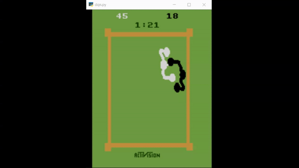
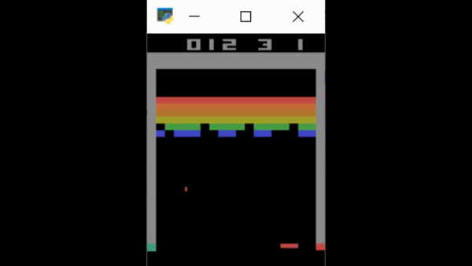

# Human-Level Control through Deep Reinforcement Learning

Tensorflow implementation of [Human-Level Control through Deep Reinforcement Learning](https://web.stanford.edu/class/psych209/Readings/MnihEtAlHassibis15NatureControlDeepRL.pdf).


This implementation contains:

1. Deep Q-network and Q-learning
2. Experience replay memory
    - to reduce the correlations between consecutive updates
3. Network for Q-learning targets are fixed for intervals
    - to reduce the correlations between target and predicted Q-values

## Requirements
   - Python 3.6
   - gym
   - tensorflow

## how to use
> Using config.json
```js
    /*Config for CartPole-v0*/
    {   
    "env_type": "2D",                    // Env type: Dimensions of input game state 2D or 3D "Box2d has 2d env and Atari has 3d env but if you use atari ram has env type 2d"
    "game_name": "CartPole-v0",          // Game name
    "learning_rate": 0.0025,             // Learning Rate
    "decay_rate" : 1.001,                // Decay rate
    "num_of_game_play": 100000,          // Nmber of game play
    "learning_start_after_frames": 1000, // Number of random game play before learning
    "update_main_model": 1,              // update rate of your main model
    "update_target_model": 1,            // update rate of your target model
    "check_point" : "Check_point/Boxing-ram-v4_20200719184545_reward_80.0_frames_2816825.h5", // Check point path for resume or testing
    "render": true,                      // Gamplay desplay on screen or not 

    "training" : {                       // Training config
        "training": true,                // Want to train
        "save_model": false,             // Save Model??
        "resume": false,                 // Resume model form check_point path
        "batch_size": 32,                // Batch size
        "memory_max_size": 100000         // Memory for store frams
        
    },
    "testing":{                          // Testing config
        "testing": false
    }
}
```
- Using config play around different games  

## how to run
```sh
    python dqn.py
```

## Results

Result of training on cpu 2 hrs


Result of training on cpu 4 hrs



## Acknowledgement

[Beat Atari with Deep Reinforcement Learning! (Part 1: DQN)](abecominghuman.ai/lets-build-an-atari-ai-part-1-dqn-df57e8ff3b26)